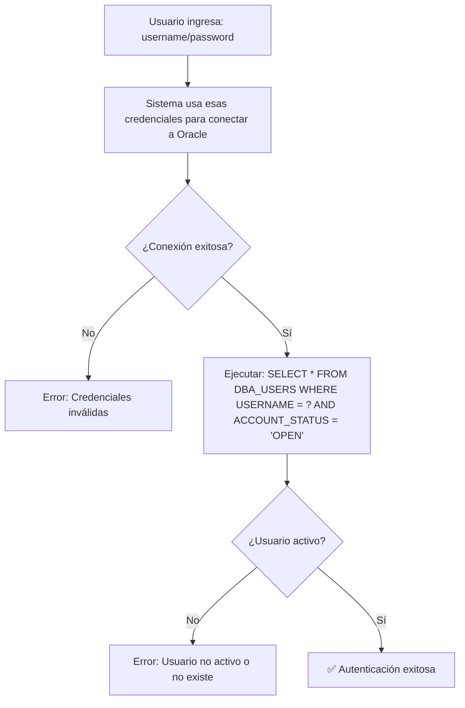

# ✅ SISTEMA DE AUTENTICACIÓN ACTUALIZADO

## 🔥 Cambios Implementados

Se ha modificado completamente el sistema de autenticación para usar **conexión directa con las credenciales del usuario**, tal como solicitaste.

## 📋 Nuevo Flujo de Autenticación

### 1. **Conexión Directa**


### 2. **¿Qué hace ahora el sistema?**

1. **Toma las credenciales del formulario** (username/password)
2. **Crea una conexión directa a Oracle** usando esas credenciales exactas
3. **Si la conexión falla** → Usuario/contraseña incorrectos
4. **Si la conexión es exitosa** → Ejecuta tu query específico:
   ```sql
   SELECT * FROM DBA_USERS WHERE USERNAME = ? AND ACCOUNT_STATUS = 'OPEN'
   ```
5. **Verifica que ACCOUNT_STATUS = 'OPEN'** para permitir acceso

## 🔧 Detalles Técnicos

### Método `validateOracleConnection()`
- ✅ **NO usa más las credenciales de `db.properties`**
- ✅ **Usa las credenciales que el usuario ingresó en el login**
- ✅ **Intenta conexión directa** con `DriverManager.getConnection()`
- ✅ **Ejecuta tu query específico** contra `DBA_USERS`
- ✅ **Valida `ACCOUNT_STATUS = 'OPEN'`**

### Método `createDirectConnection()`
- Toma la URL de `db.properties` (solo la URL)
- Usa las credenciales del usuario para la conexión
- Configuración: `user=USERNAME, password=PASSWORD`

### Logs Detallados
```
=== VALIDANDO USUARIO CON CONEXIÓN DIRECTA ===
Usuario: PROMO
Intentando conexión directa a Oracle...
URL de conexión: jdbc:oracle:thin:@192.168.1.7:1521:OPENFLEX
Usuario para conexión: PROMO
✅ Conexión exitosa establecida para usuario: promo
Validando estado en DBA_USERS...
Query: SELECT * FROM DBA_USERS WHERE USERNAME = ? AND ACCOUNT_STATUS = 'OPEN'
✅ Usuario encontrado y activo en Oracle DB:
   - Username: PROMO
   - Account Status: OPEN
   - Created: 2024-01-15 10:30:00
   - Default Tablespace: USERS
```

## 🚀 Para Probar el Sistema

### 1. **Prerequisitos**
- Usuario `PROMO` debe existir en Oracle
- `ACCOUNT_STATUS` debe ser `'OPEN'`
- Verificar con:
  ```sql
  SELECT USERNAME, ACCOUNT_STATUS, CREATED 
  FROM DBA_USERS 
  WHERE USERNAME = 'PROMO';
  ```

### 2. **Casos de Prueba**

| Escenario | Usuario | Password | Resultado Esperado |
|-----------|---------|----------|-------------------|
| Usuario válido | promo | promo | ✅ Acceso permitido |
| Password incorrecto | promo | wrong | ❌ Error conexión Oracle |
| Usuario inexistente | noexiste | any | ❌ Error conexión Oracle |
| Usuario bloqueado | promo | promo | ❌ Error: Account status no OPEN |

### 3. **Errores Oracle Detectados**
- **Error 1017**: Usuario o contraseña inválidos
- **Error 28000**: Cuenta bloqueada  
- **Error 28001**: Contraseña expirada

## 🔒 Ventajas de este Enfoque

### ✅ **Autenticación Real**
- Usa las credenciales reales del usuario
- No depende de un usuario "de aplicación"
- Valida directamente contra Oracle

### ✅ **Seguridad Robusta**
- Si Oracle rechaza la conexión = No acceso
- Respeta políticas de Oracle (bloqueos, expiraciones, etc.)
- Query directo a `DBA_USERS` como solicitaste

### ✅ **Sincronización Automática**
- Estado de usuario en Oracle = Estado en aplicación
- No hay desfase entre sistemas
- Cambios en Oracle se reflejan inmediatamente

## 🛠️ Configuración Actual

### `db.properties` (solo para URL)
```properties
DB_URL=jdbc:oracle:thin:@192.168.1.7:1521:OPENFLEX
# username/password ya no se usan para autenticación
DB_USERNAME=promo  # Solo para operaciones del sistema
DB_PASSWORD=promo  # Solo para operaciones del sistema
```

### Flujo de Datos
1. **Login**: Usuario ingresa `promo/promo`
2. **Conexión**: Sistema usa `promo/promo` para conectar a Oracle
3. **Validación**: Sistema ejecuta tu query exacto
4. **Resultado**: Si todo OK → Acceso permitido

## 📞 Troubleshooting

### Error: "table or view does not exist"
- **Causa**: Usuario no tiene permisos para acceder a `DBA_USERS`
- **Solución**: Otorgar permisos o usar vista alternativa:
  ```sql
  GRANT SELECT ON DBA_USERS TO PROMO;
  -- O usar ALL_USERS si no tienes permisos DBA
  ```

### Error: "invalid username/password"
- **Causa**: Credenciales incorrectas o usuario bloqueado
- **Solución**: Verificar estado del usuario:
  ```sql
  SELECT USERNAME, ACCOUNT_STATUS FROM DBA_USERS WHERE USERNAME = 'PROMO';
  ```

---

## 🎯 **Resumen**

✅ **ANTES**: Sistema conectaba con `db.properties` y validaba manualmente  
✅ **AHORA**: Sistema usa credenciales del usuario directamente en la conexión Oracle  
✅ **QUERY**: Exactamente como solicitaste: `SELECT * FROM DBA_USERS WHERE USERNAME = 'PROMO' AND ACCOUNT_STATUS = 'OPEN'`  
✅ **AUTENTICACIÓN**: 100% basada en Oracle Database real

**El sistema está listo para usar con autenticación real contra Oracle! 🚀** 