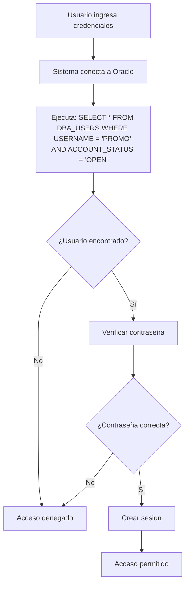

# Sistema de Autenticación - Módulo de Promociones

## 🔐 Descripción General

Se ha implementado un sistema completo de autenticación para proteger todo el módulo de promociones, garantizando que solo usuarios autenticados puedan acceder a cualquier funcionalidad del sistema.

**🔥 NUEVA FUNCIONALIDAD**: La validación ahora consulta directamente la tabla `DBA_USERS` de Oracle para verificar que el usuario exista y esté activo.

## 🏗️ Arquitectura del Sistema

### Componentes Implementados

1. **Modelo de Usuario** (`User.java`)
   - Representa usuarios del sistema
   - Atributos: username, fullName, email, role, active, lastLogin

2. **DAO de Usuarios** (`UserDAO.java`)
   - **Autenticación real contra Oracle**: Consulta `DBA_USERS`
   - Validación de estado de cuenta (`ACCOUNT_STATUS = 'OPEN'`)
   - Gestión de usuarios automática

3. **Controlador de Login** (`LoginController.java`)
   - Maneja login/logout
   - Gestión de sesiones
   - Redirecciones seguras

4. **Filtro de Autenticación** (`AuthenticationFilter.java`)
   - Protege todas las rutas del sistema
   - Intercepta requests no autenticados
   - Redirige al login automáticamente

5. **Página de Login** (`login.jsp`)
   - Interfaz moderna y responsive
   - Validación en frontend
   - Mensajes de error/éxito

## 🔧 Configuración de Base de Datos

### 1. Validación de Usuario Oracle

El sistema ahora usa esta consulta para validar usuarios:

```sql
SELECT * FROM DBA_USERS 
WHERE USERNAME = 'PROMO' 
AND ACCOUNT_STATUS = 'OPEN'
```

**Requisitos**:
- El usuario debe existir en `DBA_USERS`
- El `ACCOUNT_STATUS` debe ser `'OPEN'`
- Se valida tanto la existencia como el estado activo

### 2. Ejecutar Script SQL

Ejecute el script `database_setup.sql` conectado como usuario 'promo':

```sql
sqlplus promo/promo@192.168.1.7:1521/OPENFLEX
@database_setup.sql
```

### 3. Tabla SYSTEM_USERS

El script crea automáticamente:

```sql
CREATE TABLE SYSTEM_USERS (
    username        VARCHAR2(50)    NOT NULL,
    full_name       VARCHAR2(200)   NOT NULL,
    email           VARCHAR2(100),
    active          CHAR(1)         DEFAULT 'Y',
    role            VARCHAR2(50)    DEFAULT 'USER',
    created_date    DATE            DEFAULT SYSDATE,
    last_login      DATE,
    -- otros campos...
);
```

### 4. Usuarios por Defecto

El sistema crea automáticamente estos usuarios:

| Usuario | Contraseña | Rol | Estado | Validación Oracle |
|---------|------------|-----|--------|-------------------|
| promo | promo | ADMIN | Activo | ✅ Consulta DBA_USERS |
| operador1 | promo | USER | Activo | ✅ Si usuario Oracle existe |
| consultor | promo | VIEWER | Activo | ✅ Si usuario Oracle existe |

## 🚀 Cómo Usar el Sistema

### 1. Acceso Inicial

1. **Verificar usuario Oracle**: Asegúrese que el usuario 'PROMO' existe y está activo:
   ```sql
   SELECT USERNAME, ACCOUNT_STATUS, CREATED 
   FROM DBA_USERS 
   WHERE USERNAME = 'PROMO';
   ```

2. Acceda a cualquier URL del módulo de promociones
3. Será redirigido automáticamente al login
4. Use las credenciales: **promo / promo**
5. El sistema validará contra `DBA_USERS` y permitirá el acceso

### 2. Proceso de Validación



### 3. Gestión de Sesiones

- **Duración por defecto**: 8 horas
- **Con "Recordarme"**: 7 días
- **Auto-logout**: Al cerrar navegador (sin recordar)

### 4. Navegación

- **Barra superior**: Muestra información del usuario logueado
- **Botón "Salir"**: Cierra sesión con confirmación
- **Redirecciones**: Mantiene la URL destino después del login

## 🔒 Características de Seguridad

### Protección Completa
- ✅ Todas las rutas protegidas por defecto
- ✅ **Validación real contra Oracle DB**
- ✅ Verificación de estado de cuenta Oracle
- ✅ Filtro de seguridad a nivel de aplicación
- ✅ Validación en cada request
- ✅ Sesiones seguras con HttpOnly cookies

### Validaciones Oracle
- ✅ **Consulta DBA_USERS**: Verifica existencia real del usuario
- ✅ **ACCOUNT_STATUS**: Solo usuarios con estado 'OPEN'
- ✅ **Logging detallado**: Muestra información del usuario Oracle
- ✅ **Manejo de errores**: Logs claros para troubleshooting

### Rutas Excluidas
- `/auth/login` - Página de login
- `/auth/logout` - Cerrar sesión
- `/auth/check` - Verificación AJAX
- `/assets/*` - Recursos estáticos
- Archivos estáticos (.css, .js, .png, etc.)

### Manejo de Errores
- **401/403/404**: Redirigen al login
- **Usuario no existe en Oracle**: Acceso denegado
- **Account status no OPEN**: Acceso denegado
- **Timeout de sesión**: Redirige al login automáticamente
- **Errores de BD**: Mensajes amigables al usuario

## 📋 Logs de Validación

El sistema ahora genera logs detallados durante la validación:

```
=== VALIDANDO USUARIO EN ORACLE ===
Usuario: PROMO
Query: SELECT * FROM DBA_USERS WHERE USERNAME = ? AND ACCOUNT_STATUS = 'OPEN'
✅ Usuario encontrado en Oracle DB:
   - Username: PROMO
   - Account Status: OPEN
   - Created: 2024-01-15 10:30:00
✅ Credenciales válidas para usuario: promo
```

## 🛠️ Personalización

### Verificar Estado de Usuario Oracle

```sql
-- Ver estado actual del usuario
SELECT USERNAME, ACCOUNT_STATUS, LOCK_DATE, EXPIRY_DATE, CREATED
FROM DBA_USERS 
WHERE USERNAME = 'PROMO';

-- Desbloquear usuario si está bloqueado
ALTER USER PROMO ACCOUNT UNLOCK;

-- Verificar usuarios Oracle disponibles
SELECT USERNAME, ACCOUNT_STATUS, CREATED
FROM DBA_USERS 
WHERE ACCOUNT_STATUS = 'OPEN'
ORDER BY USERNAME;
```

### Agregar Nuevos Usuarios

```sql
-- Crear usuario en Oracle primero
CREATE USER nuevo_usuario IDENTIFIED BY password;
GRANT CONNECT, RESOURCE TO nuevo_usuario;

-- Luego agregarlo al sistema
INSERT INTO SYSTEM_USERS (username, full_name, email, role) 
VALUES ('nuevo_usuario', 'Nombre Completo', 'email@dominio.com', 'USER');
```

### Desactivar Usuario

```sql
-- Bloquear en Oracle
ALTER USER usuario_name ACCOUNT LOCK;

-- Desactivar en sistema
UPDATE SYSTEM_USERS 
SET active = 'N' 
WHERE username = 'usuario_name';
```

### Roles Disponibles
- **ADMIN**: Acceso completo al sistema
- **USER**: Usuario normal con permisos estándar
- **VIEWER**: Solo lectura

## 🔍 Monitoreo y Auditoría

### Ver Usuarios Activos

```sql
-- Usuarios del sistema
SELECT * FROM VW_ACTIVE_USERS;

-- Usuarios Oracle activos
SELECT USERNAME, ACCOUNT_STATUS, LAST_LOGIN, LOCK_DATE
FROM DBA_USERS 
WHERE ACCOUNT_STATUS = 'OPEN'
ORDER BY USERNAME;
```

### Logs de Auditoría

El sistema incluye:
- Validación en tiempo real contra `DBA_USERS`
- Logs detallados de cada intento de login
- Información completa del usuario Oracle
- Trigger de auditoría para cambios en `SYSTEM_USERS`

### Información Disponible
- Estado real del usuario en Oracle
- Fecha de creación de la cuenta Oracle
- Último login de cada usuario
- Intentos fallidos de autenticación
- Estados de cuenta (activo/bloqueado/expirado)

## 🚨 Troubleshooting

### Problema: "Usuario no encontrado en Oracle"
**Solución**: 
```sql
-- Verificar si el usuario existe
SELECT * FROM DBA_USERS WHERE USERNAME = 'PROMO';

-- Si no existe, crearlo
CREATE USER PROMO IDENTIFIED BY promo;
GRANT CONNECT, RESOURCE TO PROMO;
```

### Problema: "Account status no OPEN"
**Solución**:
```sql
-- Ver estado actual
SELECT USERNAME, ACCOUNT_STATUS FROM DBA_USERS WHERE USERNAME = 'PROMO';

-- Desbloquear si está locked
ALTER USER PROMO ACCOUNT UNLOCK;
```

### Problema: Error de permisos en DBA_USERS
**Solución**: Verificar que el usuario de conexión tenga permisos para consultar `DBA_USERS`

### Problema: Sesión expira muy rápido
**Solución**: Ajustar timeout en `web.xml` o usar "Recordarme"

## 📞 Soporte

Para soporte técnico:

1. **Revisar logs de validación Oracle** en la consola de la aplicación
2. **Verificar estado del usuario**: `SELECT * FROM DBA_USERS WHERE USERNAME = 'PROMO'`
3. **Comprobar conectividad**: Probar conexión directa a Oracle
4. **Validar permisos**: Asegurar acceso a `DBA_USERS`

## 🔄 Próximas Mejoras

- [ ] Autenticación de dos factores (2FA)
- [ ] Validación de contraseña contra Oracle directamente
- [ ] Integración completa con políticas de Oracle
- [ ] Sincronización automática de usuarios Oracle
- [ ] Dashboard de administración de usuarios
- [ ] Logs detallados de auditoría con timestamps

---

**Nota**: Este sistema ahora valida usuarios reales de Oracle Database, proporcionando autenticación robusta y segura basada en la infraestructura existente de Oracle. 